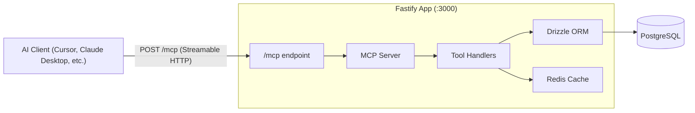

# Junction Engine MCP Server

## Architecture

Integrate the MCP server directly into the existing Fastify application as a route plugin, mounted at `/mcp`. This reuses the existing DB and Redis connections.




## Dependencies

```bash
bun add @modelcontextprotocol/sdk zod
```

`zod` is used for tool parameter schemas. The `@modelcontextprotocol/sdk` v1.x is the stable release.

## Tools to Implement

Designed around real questions Princeton students ask when planning their semesters.

### Course Discovery (read-only)


| Tool                  | Example Student Question                                                                                    | Parameters                                           |
| --------------------- | ----------------------------------------------------------------------------------------------------------- | ---------------------------------------------------- |
| `search_courses`      | "What COS courses are available?" / "Courses about machine learning" / "Find me an LA course"               | `term?`, `department?`, `query?`, `dist?`            |
| `get_course_details`  | "Tell me about COS 226 — what's the grading like, is there a final?"                                        | `courseId` or `code` (e.g., "COS 226")               |
| `get_course_sections` | "What sections are open for COS 126? When do they meet?"                                                    | `courseId`                                           |
| `list_departments`    | "What departments are there?"                                                                               | (none)                                               |
| `discover_courses`    | "What are some new interesting courses this semester?" / "Show me small seminars" / "Courses with no final" | `filter`: `new`, `small_seminar`, `no_final`, `open` |


### Evaluations (read-only)


| Tool                       | Example Student Question                                                                                  | Parameters                                     |
| -------------------------- | --------------------------------------------------------------------------------------------------------- | ---------------------------------------------- |
| `get_course_evaluations`   | "What do students think of COS 226?" / "How is AAS 231 rated?"                                            | `listingId` or `code`                          |
| `find_top_rated_courses`   | "What are the highest rated courses?" / "Best courses in the COS department?" / "Top LA courses?"         | `department?`, `dist?`, `minRating?`, `limit?` |
| `summarize_course_reviews` | "What are the common themes in reviews for COS 126?" (returns comments + rating for the AI to synthesize) | `listingId` or `code`, `term?`                 |


### Instructors (read-only)


| Tool                     | Example Student Question                                                     | Parameters |
| ------------------------ | ---------------------------------------------------------------------------- | ---------- |
| `get_instructor`         | "Who is Robert Dondero?"                                                     | `netid`    |
| `search_instructors`     | "Find professors named Dondero"                                              | `name`     |
| `get_instructor_courses` | "What does Professor Kernighan teach?" / "What courses does rdondero teach?" | `netid`    |


### Schedule Planning (read-only)


| Tool                    | Example Student Question                                                                           | Parameters                           |
| ----------------------- | -------------------------------------------------------------------------------------------------- | ------------------------------------ |
| `get_user_schedules`    | "Show my schedules"                                                                                | `userId`, `term?`                    |
| `get_schedule_details`  | "What's in my schedule? Any time conflicts?"                                                       | `scheduleId`                         |
| `find_courses_that_fit` | "What COS courses fit in my schedule?" / "Find an LA course that doesn't conflict with my classes" | `scheduleId`, `department?`, `dist?` |


## Key Student Use Cases

These are the kinds of compound questions the AI client can answer by combining tools:

1. **"What are some new interesting courses this semester?"** — `discover_courses(filter: "new")` + `get_course_evaluations` on results
2. **"What's the best course to fulfill my LA requirement?"** — `find_top_rated_courses(dist: "LA")` + `get_course_details` for top results
3. **"I want a chill class with no final — what do you recommend?"** — `discover_courses(filter: "no_final")` + `find_top_rated_courses` cross-referenced
4. **"What do students actually say about COS 217?"** — `summarize_course_reviews(code: "COS 217")` returns all comments for the AI to synthesize
5. **"What courses can I take that don't conflict with my schedule?"** — `find_courses_that_fit(scheduleId, department: "COS")`
6. **"Compare COS 226 and COS 217"** — AI calls `get_course_details` + `get_course_evaluations` for both and presents a comparison
7. **"Who are the best professors in the CS department?"** — `find_top_rated_courses(department: "COS")` grouped by instructor

## File Structure

- **[`src/mcp/index.ts`]** - MCP server setup, tool registration, Streamable HTTP transport handling
- **[`src/mcp/tools/courses.ts`]** - Course search/detail/section/discovery tools
- **[`src/mcp/tools/evaluations.ts`]** - Evaluation lookup, top-rated search, and review summary tools
- **[`src/mcp/tools/instructors.ts`]** - Instructor search and course listing tools
- **[`src/mcp/tools/schedules.ts`]** - Schedule read tools and schedule-aware course finding
- **[`src/routes/mcp.ts`]** - Fastify route plugin that bridges HTTP requests to the MCP server

## Integration into Fastify

The MCP endpoint is registered as a Fastify route plugin in `[src/app.ts](apps/engine/src/app.ts)`, following the same pattern as existing routes:

```typescript
import mcpRoutes from "./routes/mcp.ts";
// ...
app.register(mcpRoutes, { prefix: "/mcp" });
```

The route plugin at `src/routes/mcp.ts` will:

1. Create a `Server` instance from `@modelcontextprotocol/sdk`
2. Register all tools
3. Handle POST requests by creating a `StreamableHTTPServerTransport` and connecting it to the MCP server
4. Manage sessions via `mcp-session-id` header

Each tool handler receives `app.db.db` (Drizzle instance) to query the database directly, same as the existing route handlers.

## Key Implementation Details

- **Course lookup by code**: Several tools accept a human-readable `code` like "COS 226" in addition to the internal `courseId`. These do a `LIKE` query on `courses.code`.
- **Eval lookup by code**: Evaluation tools resolve course codes to `listing_id` by joining with the `courses` table, so students can ask "reviews for COS 226" naturally.
- `**discover_courses**`: Queries for courses matching filters — `new` checks for high listing IDs (first-time offerings), `small_seminar` filters by low capacity sections, `no_final` uses the `has_final` flag, `open` checks section status.
- `**find_courses_that_fit**`: Loads the user's existing schedule sections, computes occupied time slots, then finds courses whose sections don't overlap. Optionally filters by department or distribution area.
- `**summarize_course_reviews**`: Returns the raw comments array and ratings so the AI client can generate a natural language summary. The tool doesn't summarize itself — it provides the data for the LLM to work with.
- **Caching**: Course-heavy tools use the existing Redis `getOrSetJson` pattern where appropriate.
- **Error handling**: Tools return `isError: true` with a descriptive message on failure, rather than throwing.
- **Session management**: Use in-memory Map for session-to-transport mapping (sufficient for single-instance local dev).

## Testing

Add a test file `src/tests/mcp.test.ts` that verifies:

- MCP endpoint responds to POST
- Tool listing works
- A sample tool call returns expected data

