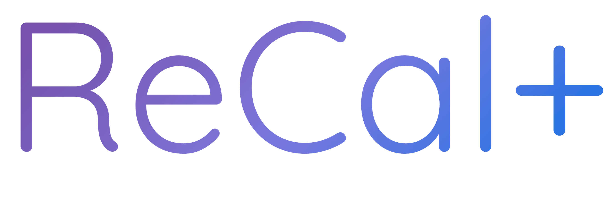
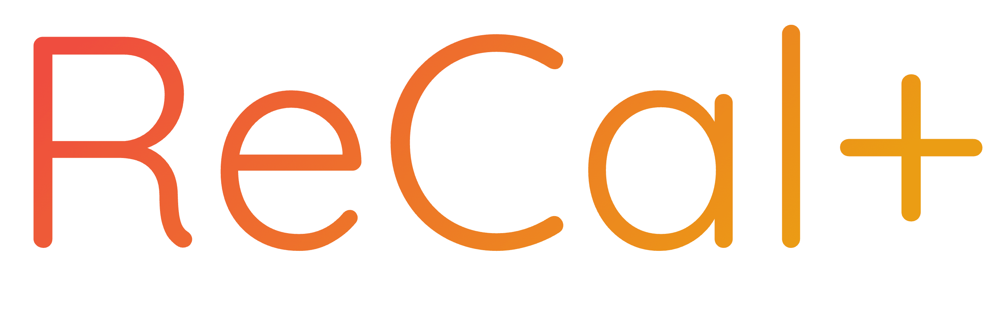
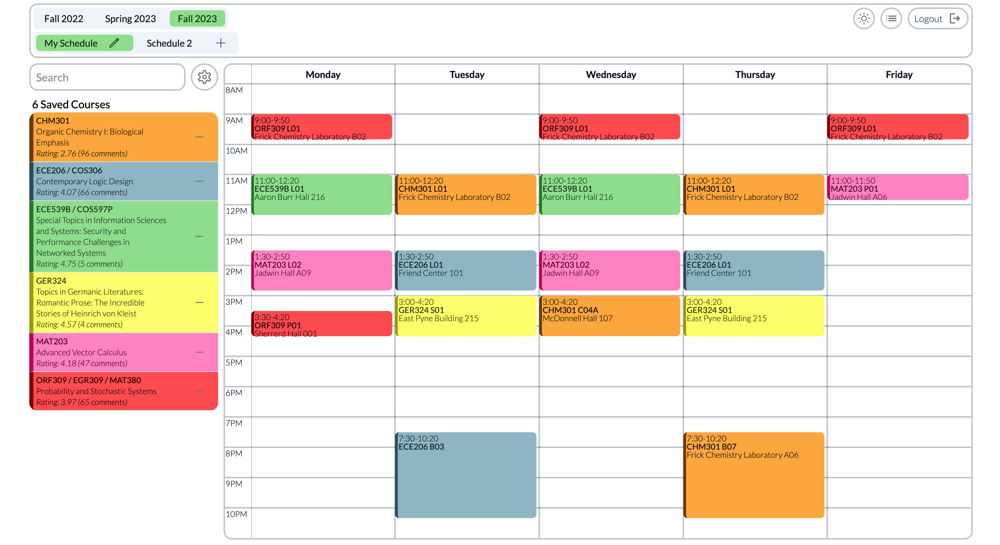

<h1 align="center">

</h1>

  <i align="center">✨ Princeton course selection, amplified ✨</i>

`TigerJunction` (currently only `ReCal+`) is your ultimate destination for a seamless and customizable Princeton course planning and selection experience. By integrating and extending the capabilities of five powerful [TigerApps](https://tigerapps.org/) – [ReCal](https://recal.io/), [TigerPath](https://www.tigerpath.io/), [PrincetonCourses](https://www.princetoncourses.com/), [TigerMap](https://tigermap.tigerapps.org/), and [TigerSnatch](https://tigersnatch.com/) – TigerJunction revolutionizes the way you navigate your academic journey. 

## Support

If you have any questions, feedback, or need assistance, feel free to reach out to me at motoaki@princeton.edu. 

