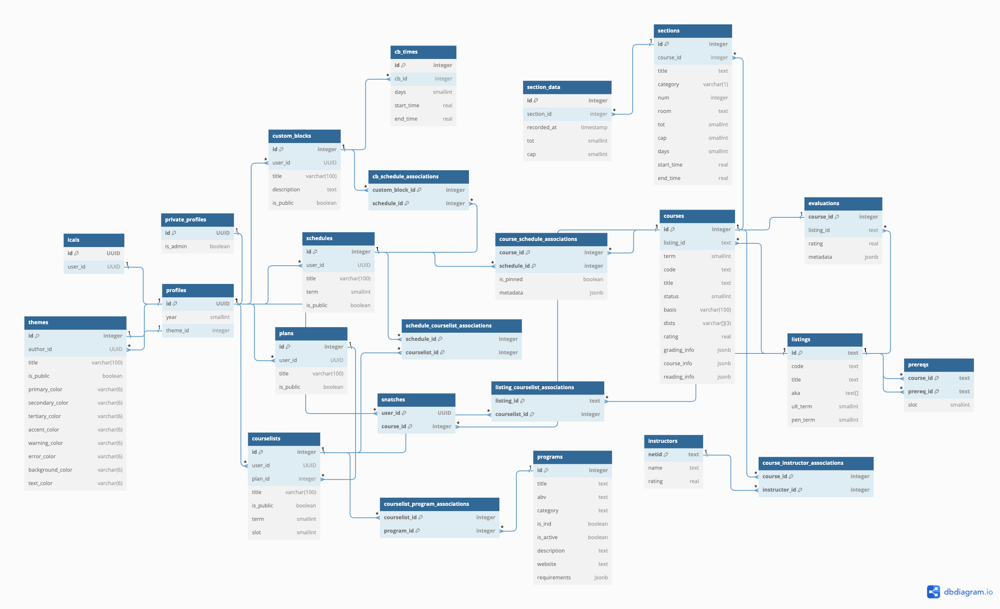

<h1 align="center">

</h1>

  <i align="center">✨ Princeton course selection, amplified ✨</i>

`TigerJunction` is the premier application for academic planning at Princeton University.

### ReCal+

Based heavily on [ReCal](https://recal.io/), `ReCal+` allows easy schedule planning with a visual calendar, powerful advanced search and filtering, built-in course ratings, and iCal exporting.

### Student Developer API (Coming Soon)

GraphQL and REST APIs for Princeton student developers. Data sources include course details, prerequisites, program requirements (majors, minors, certificates), and TigerJunction specific data. Once released, information about obtaining an API Key will be avaliable.

## Tech Stack

Unlike most Princeton student applications, `TigerJunction` utilizes a JS backend (with SvelteKit) and is hosted primarily with serverless cloud providers. There are many reasons for this: cost minimization, being developed separately from COS333 (Princeton's project-based software engineering course), and preferring JS over Python for web development.

**Languages:** JavaScript, TypeScript, SQL, HTML, CSS

**Libraries/Frameworks:** Svelte, SvelteKit, TailwindCSS, MeltUI, Vite

**Backend:** Supabase (PostgreSQL and Deno), AWS (Lambda, S3, Cloudfront; through SST), Cloudflare (DNS, DoS Protection, R2, and Workers), Redis, NodeJS, Princeton StudentApp API

**Dev Tools:** Git, GitHub, GitHub Actions, Prettier

## Acknowledgements

This project is sponsored by [TigerApps](https://tigerapps.org/) (a Princeton USG initiative), and is inspired by 4 other TigerApps: [ReCal](https://recal.io/), [TigerPath](https://www.tigerpath.io/), [PrincetonCourses](https://www.princetoncourses.com/), [TigerMap](https://tigermap.tigerapps.org/). While it does not use any of the code from these projects, they guided decisions about UI, functionality, and overall project design. Additional thanks to the Princeton OIT for providing their API.

This project would also not have been possible without the numerous students who gave and continue to give valuable input and feedback.

## Contact

Please join our email list [here](https://docs.google.com/forms/d/e/1FAIpQLSebVwd90RtgYf0WtPueOF2BUh8gX2zl-C6Tbjtfxo1E6jo6xA/viewform?usp=sf_link) to receive periodic updates on `TigerJunction`. If you have any questions, feedback, or need assistance, feel free to reach out to us at it.admin@tigerapps.org

## Screenshots

Screenshot of ReCal+ App

 

The entity relationship diagram for the entire app

